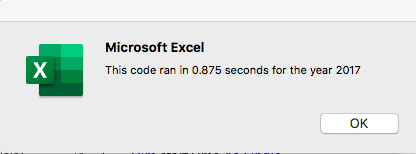
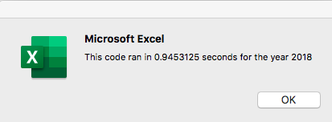
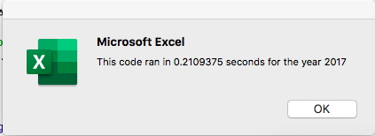

# Stock Analysis - VBA Challenge

## Overview of Project
The purpose of this project was to refactor the Module 2 solution code to loop through all the data one time in order to collect the same information that was collected in the module.  Once refactored, we were hoping to examine whether refactoring the code made the VBA script run faster.  

## Results

For both years, the refactored code was executed more quickly.  The times for the refactored code are shown below.

## Summary

The advantages of refactoring code are that it potentially reduces execution times and makes the code more readable and efficient.  Disadvanatges are that it is time consuming and may introduce bugs into the code. 

The new code is more efficient as it loops through the code just one time, helping to reduce execution time. 
